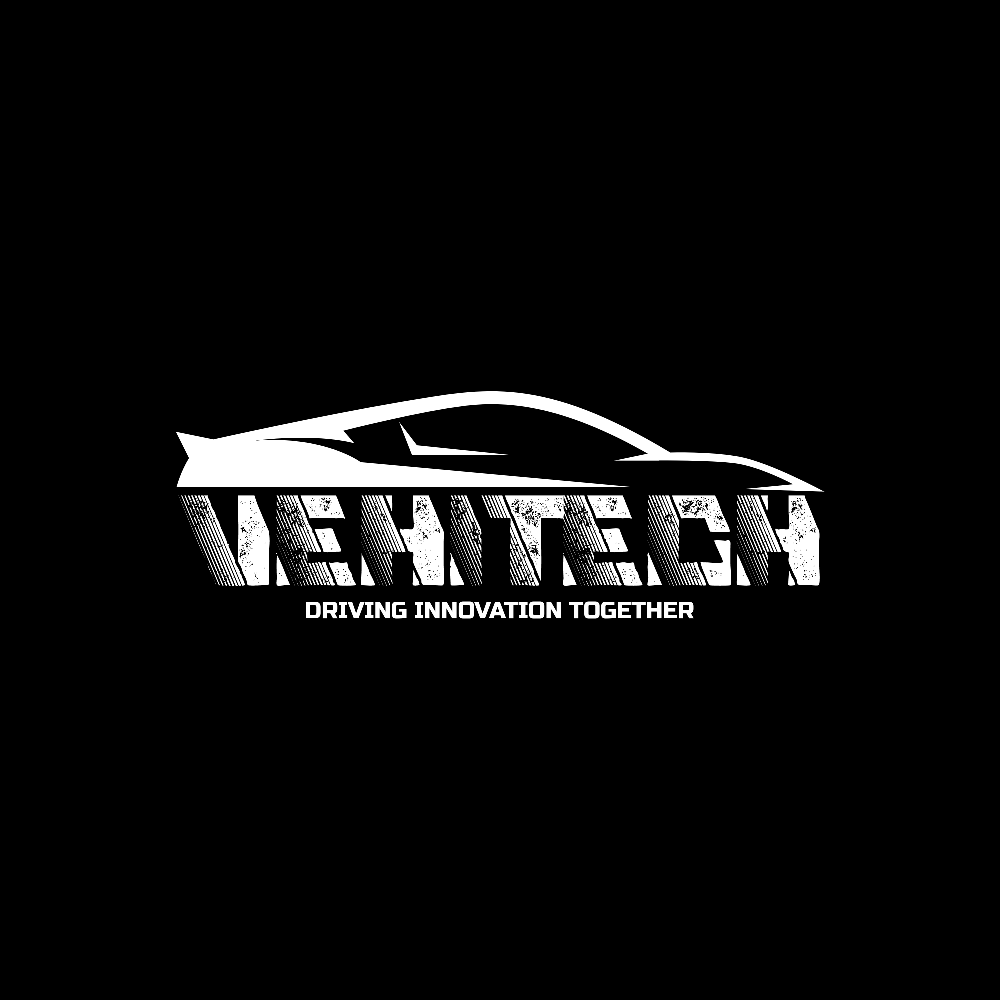

# VehiTech

## About

VehiTech is an initiative by [@NoahGWood](github.com/NoahGWood/) to create open-source, open-hardware tools and parts for the automotive industry.

## Projects

### ACU
**[ACU](https://github.com/VehiTech/ACU)** - The Modular Automotive Control Unit Specification 

### OpenIgnition
**[OpenIgnition](https://github.com/VehiTech/OpenIgnition)** - An open-source, open-hardware ignition driver circuit for the automotive industry.

## In The Works

### OpenECU
**[OpenECU](https://github.com/VehiTech/OpenECU)** - An open-hardware Engine Control Unit for internal combustion engines

### VehiTechOS
**[VehiTechOS](https://github.com/VehiTech/VehiTechOS)** - A modular operating system for vehicles.

## Coming Soon

### Tools

#### [VersaMachina](https://github.com/NoahGWood/VersaMachina)
##### Features

* Built-in app editor
* OpenGL support
* VehiTechOS integration
* C# Scripting

#### AutoBot
##### Features:

* JSON structured configuration file
* Automatic KiCAD Schematic generation
* Powered by premake & LUA
* Easy project setup
* Integrates with VersaMachina

### Modules

* Chassis Control Module
* Communication Gateway Module
* Driver Assistance Module
* Electrical Control Module
* Battery Control Module
* Powertrain Control Module (PCM)
* Fuel Injection Module
* Exhaust Gas Recirculation (EGR) Module 
* HVAC Control Module
* Infotainment Module
* Lighting Control Module
* Powertrain Control Module (PCM)
* Safety Control Module
* Sensor Interface Module
* Steering Control Module
* Vehicle Body Control Module (BCM)
* Vehicle Information Control Module

